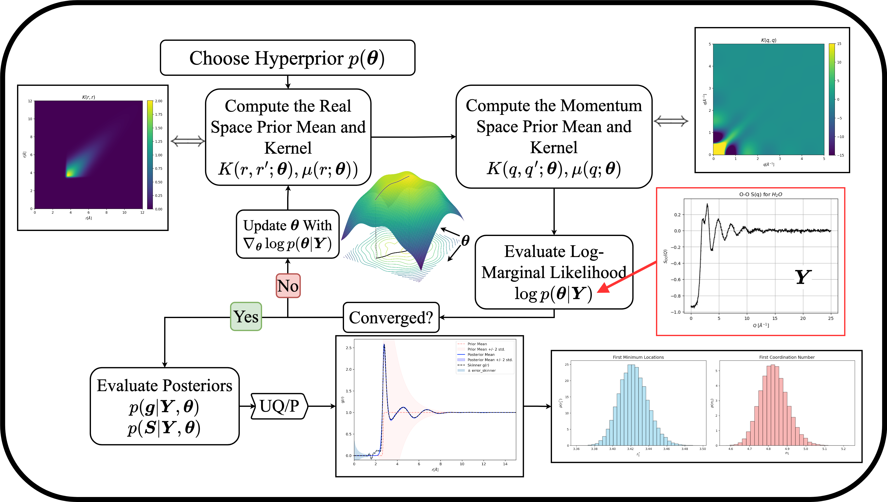

# LiquidStructureGP-Sullivan

Reference material for "Physics-Informed Gaussian Process Inference of Liquid Structure from Scattering Data" by Sullivan, Shanks, Cervenka and Hoepfner (2025)

---

We present a nonparametric Bayesian framework to infer radial distribution functions from experimental scattering measurements with uncertainty quantification using **non-stationary Gaussian processes**. The Gaussian process prior mean and kernel functions are designed to resolve well-known numerical problems with the Fourier transform, including discrete measurement binning and detector windowing, while encoding fundamental yet minimal physical knowledge of liquid structure. We demonstrate uncertainty propagation of the Gaussian process posterior to unmeasured quantities of interest. The methodology is applied to **liquid argon** and **water** as a proof of principle.

---

---
## Directory Structure

The repository is organized by **material type** (e.g., `Argon/`, `H2O/`), with subfolders further separated into:

- `Experimental/`: Experimental dataset analyis
- `Simulated/`: Simulated dataset analysis

## Core Code

The primary implementation of the Gaussian process Fourier transform framework is contained in `gptransform.py`. Each notebook utilizes the LMLH function in tandem with PyTorch optimizers to train the GP hyperparameters. The resulting GPs are then used to perform uncertainity quantification on the real space liquid structure, coordination number, and structure factor.

Please reach out if you want to use this method and have any questions. We are happy to help.
